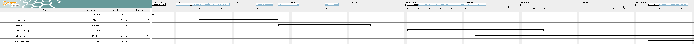

# Project Repository 
 
Welcome to the project repository for Team 4- the Big Bang Brokers. We are creating an intergalactic marketplace. 
This is an e-commerce experience designed for users to browse and buy planets from across the universe. 
We will be using Python, Flask, and SQLite as the foundation for our website. 
Here, we will document our presentations, artifacts, and source code for our project. 
 

--- 

## Meet Our Team 
All resumes are located [here](./project-plan/resumes/) and are formatted in Markdown. 
- [Nish Patel](./project-plan/resumes/Resume-NishPatel.md)
- [Dhir Patel](./project-plan/resumes/Resume-DhirPatel.md)
- [Christine Gyimah](./project-plan/resumes/Resume-ChristineGyimah.md)
- [Rachel Agbenu](./project-plan/resumes/Resume-RachelAgbenu.md)
- [Isabella White](./project-plan/resumes/Resume-IsabellaWhite.md)
  
--- 
## Team Assignments
Our team assignments can be found in the following directory [here](./project-plan/team-assignments/README.md). 

This document outlines the roles and contributions of each member, including responsibilities for development, design, testing, and project management. 

--- 
## Technology Selection 
Details about our technology stack, frameworks, libraries, and tools are detailed [here](./project-plan/technology-selection/README.md). 

This section explains the technologies and tools selected for the project and how they will be utilized throughout the development process

--- 
## Project Plan 
Our project planning documents are available [here](./project-plan/) in our project plan directory. 
The main project plan is documented [here](./project-plan/README.md)

That page includes: 
- A link to our Gantt Project file: [Gantt Project File](./project-plan/gantt-chart/SWE3314-Team-04-GanttPlan.gan)
- An embedded image export of our Gantt chart: [Gantt Chart Image](./project-plan/gantt-chart/SWE3314-Team-04-GanttChart.png)

- Our Loom video presentation discussing the project plan [here](https://www.loom.com)
