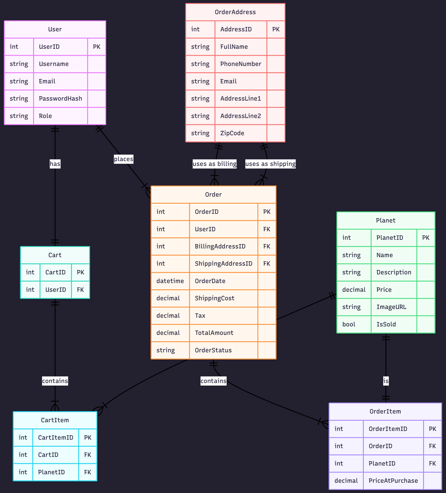

# Technical Design
This document outlines the technical architecture and implementation strategy for Big Bang Brokers, a full-stack web application designed for selling planets to clients. It details the technologies, frameworks, and data storage solutions that will be used to support a strong and maintainable system.

## Table of Contents

- [Implementation Languages]()
- [Implementation Framework]()
- [Data Storage Plan]()
- [Entity Relationship Diagram]()
- [Entity/Field Descriptions]()
- [Data Examples]()
- [Database Seed Data]()
- [Authentication and Authorization Plan]()
- [Coding Style Guide]()
- [Technical Design Presentation]()

  ## Implementation Languages
**Backend:** Python  
- Python was chosen because our team is familiar with it and it works smoothly with the Flask framework for web development.
- Python’s syntax is beginner-friendly and allows for fast development.
- Official Python documentation can be found here: [https://docs.python.org/]  
  
**Frontend:** HTML & CSS  
- HTML and CSS will be used to build the structure and visual design of our web pages. Flask also supports HTML templates.
- Official HTML documentation: [https://developer.mozilla.org/en-US/docs/Web/HTML]
- Official CSS documentation: [https://developer.mozilla.org/en-US/docs/Web/CSS] 

**Data:** 
- **SQLite:**  
  We chose SQLite because:  
  - It is lightweight and requires no database server.  
  - All data is stored in a single file, making it easy to maintain and share.  
  - It is persistent—data remains even after the application is closed.  
  Official SQLite documentation: [https://www.sqlite.org/docs.html]
    
  ## Implementation Framework
  Our team selected Flask as our main framework.  
  **Flask**  
  - Flask is a lightweight Python web framework that requires very little configuration.
  - It allows us to easily create routes, handle forms, manage sessions, and connect to our SQL database.
  - Official Flask documentation can be found here: [https://flask.palletsprojects.com/]
  ## Data Storage Plan
  Our project will use SQLite as the database and sqlite3 library to communicate with it.
   
**SQLite**  
  - It is lightweight and requires no database server.
  - All data is stored in a single file, making it easy to maintain and share.
  - It is persistent, data remains even after the application is closed.
  - Official SQLite documentation: [https://www.sqlite.org/docs.html]    
**sqlite3**  
  - Python’s sqlite3 module will allow our Flask application to read and write to the database.
  - We will use SQL queries to insert users, store products, update carts, and process orders.
  - Official sqlite3 documentation: https://docs.python.org/3/library/sqlite3.html
    
  ## Entity Relationship Diagram
  

  
  ## Entity/Field Descriptions
  #### 1. User
  | Property     | Type | Default       | Nullable | Relationship | Notes                                      |
  |:-------------| :--- |:--------------| :--- | :--- |:-------------------------------------------|
  | **UserID**   | INT | AUTOINCREMENT | No | PK | Unique identification number for the user. |
  | **Username** | VARCHAR(50) |               | No | | Unique username used to login.             |
  | **Email**    | VARCHAR(100) |               | No | | User's email.                              |
  | **Password** | VARCHAR(255) |               | No | | Unique password used to login.             |
  | **IsAdmin**  | BOOLEAN | False         | No | | `True` if the user is an admin.            |

   

  #### 2. Planet
  | Property | Type | Default | Nullable | Relationship | Notes                                              |
  | :--- | :--- | :--- | :--- | :--- |:---------------------------------------------------|
  | **PlanetID** | INT | AUTOINCREMENT | No | PK | Unique identification number for the planet.       |
  | **Name** | VARCHAR(50) | | No | | Name of the planet.                                |
  | **Description** | TEXT | | Yes | | Short description of the planet.                   |
  | **Price** | DECIMAL(10, 2) | | No | | Price of the planet. (e.g. 250 = 250B)             |
  | **ImageURL** | VARCHAR(255) | | Yes | | THe file name used to display the planet's picture |
  | **IsSold** | BOOLEAN | False | No | | `True` if the planet has been purchased.           |

   

  #### 3. Cart
  | Property | Type | Default | Nullable | Relationship | Notes                                               |
  | :--- | :--- | :--- | :--- | :--- |:----------------------------------------------------|
  | **CartID** | INT | AUTOINCREMENT | No | PK | Unique identification number for the shopping cart. |
  | **UserID** | INT | | No | FK (User.UserID) | Links the cart to a specific user.                  |
  
   
  
  #### 4. CartItem
  | Property | Type | Default | Nullable | Relationship | Notes                                                 |
  | :--- | :--- | :--- | :--- | :--- |:------------------------------------------------------|
  | **CartItemID** | INT | AUTOINCREMENT | No | PK | Unique identification number for items inside a cart. |
  | **CartID** | INT | | No | FK (Cart.CartID) | The cart this item belongs to.                        |
  | **PlanetID** | INT | | No | FK (Planet.PlanetID) | The planet being added to the cart.                   |
  
   

  #### 5. OrderAddress
  | Property | Type | Default | Nullable | Relationship | Notes                                  |
  | :--- | :--- | :--- | :--- | :--- |:---------------------------------------|
  | **AddressID** | INT | AUTOINCREMENT | No | PK | Unique identifier for a saved address. |
  | **FullName** | VARCHAR(100) | | No | | Name of the recipient/biller.          |
  | **PhoneNumber** | VARCHAR(20) | | Yes | | Contact number.                        |
  | **Email** | VARCHAR(100) | | No | | Email for order updates.               |
  | **AddressLine1** | VARCHAR(255) | | No | | Street Address.                        |
  | **AddressLine2** | VARCHAR(255) | | Yes | | Street Address (optional).             |
  | **ZipCode** | VARCHAR(20) | | No | | Zip Code.                              |
  
   
  
  #### 6. Order
  | Property | Type | Default       | Nullable | Relationship | Notes                                                 |
  | :--- | :--- |:--------------| :--- | :--- |:------------------------------------------------------|
  | **OrderID** | INT | AUTOINCREMENT | No | PK | Unique identification number for the completed order. |
  | **UserID** | INT |               | No | FK (User.UserID) | The user who placed the order.                        |
  | **BillingAddressID** | INT |               | No | FK (OrderAddress.AddressID) | Link to billing details.                              |
  | **ShippingAddressID** | INT |               | No | FK (OrderAddress.AddressID) | Link to shipping details.                             |
  | **OrderDate** | DATETIME | REAL          | No | | Timestamp when the order was placed.                  |
  | **ShippingCost** | DECIMAL(10, 2) |               | No | | Cost based on shipping type selected.                 |
  | **Tax** | DECIMAL(10, 2) |               | No | | Calculated tax amount (6%).                           |
  | **TotalAmount** | DECIMAL(10, 2) |               | No | | Final amount due (Subtotal + Tax + Shipping).         |
  | **OrderStatus** | VARCHAR(50) | "Processing"  | No | | E.g., Processing, Shipped, Delivered.                 |
  
   

  #### 7. OrderItem
  | Property | Type | Default       | Nullable | Relationship | Notes                                                                      |
  | :--- | :--- |:--------------| :--- | :--- |:---------------------------------------------------------------------------|
  | **OrderItemID** | INT | AUTOINCREMENT | No | PK | Unique identification number for a line item in an order.                  |
  | **OrderID** | INT |               | No | FK (Order.OrderID) | The order this item belongs to.                                            |
  | **PlanetID** | INT |               | No | FK (Planet.PlanetID) | The planet purchased.                                                      |
  | **PriceAtPurchase** | DECIMAL(10, 2) |               | No | | Copy of price at time of sale (in Billions) (For use in the sales report). |
  ## Data Examples
  ####  User
  | UserID | Username | Email | Password      | IsAdmin |
  | :--- | :--- | :--- |:--------------| :--- |
  | 1 | elon_mars_fan | elon@spacex.com | 7h8j9k0l1m2n3 | False |
  | 2 | jeff_blue | jeff@origin.com | 1a2b3c4d5e6f  | False |
  | 3 | astro_mike | mike@nasa.gov | 9z8y7x6w5v4   | False |

   

  ####  Planet
  | PlanetID | Name | Description | Price | ImageURL | IsSold |
  | :--- | :--- | :--- | :--- | :--- | :--- |
  | 1 | Mercury | The swift planet. | 100.00 | mercury.png | False |
  | 2 | Saturn | Famous for its rings. | 200.00 | saturn.png | False |
  | 3 | Jupiter | The largest gas giant. | 250.00 | jupiter.png | True |
  | 4 | Neptune | The windiest icy giant. | 180.00 | neptune.png | False |

   

  #### Cart
  | CartID | UserID |
  | :--- | :--- |
  | 1 | 1 |
  | 2 | 2 |
  | 3 | 3 |

   

  #### CartItem
  | CartItemID | CartID | PlanetID |
  | :--- | :--- | :--- |
  | 1 | 1 | 1 |
  | 2 | 1 | 4 |
  | 3 | 3 | 2 |

   

  #### OrderAddress
  | AddressID | FullName | PhoneNumber | Email | AddressLine1 | AddressLine2 | ZipCode |
  | :--- | :--- | :--- | :--- | :--- | :--- | :--- |
  | 1 | Elon Musk | 555-0199 | elon@spacex.com | 1 Starbase Ln | | 78520 |
  | 2 | Jeff Bezos | 555-0100 | jeff@origin.com | 1 Blue Road | Suite 100 | 98001 |
  | 3 | Mike Hopkins | 555-0500 | mike@nasa.gov | 2 Johnson Space Ctr | | 77058 |

   

  #### Order
  | OrderID | UserID | BillingAddressID | ShippingAddressID | OrderDate | ShippingCost | Tax | TotalAmount | OrderStatus |
  | :--- | :--- | :--- | :--- | :--- | :--- | :--- | :--- | :--- |
  | 1 | 1 | 1 | 1 | 2025-11-01 10:30:00 | 29.00 | 15.00 | 294.00 | Processing |
  | 2 | 2 | 2 | 2 | 2025-11-02 14:15:00 | 19.00 | 12.00 | 231.00 | Shipped |
  | 3 | 3 | 3 | 3 | 2025-11-03 09:00:00 | 0.00 | 6.00 | 106.00 | Delivered |

   

  #### OrderItem
  | OrderItemID | OrderID | PlanetID | PriceAtPurchase |
  | :--- | :--- | :--- | :--- |
  | 1 | 1 | 3 | 250.00 |
  | 2 | 2 | 2 | 200.00 |
  | 3 | 3 | 1 | 100.00 |
      
  ## Database Seed Data
  #### 1. Entity: User (Initial Administrator)
  | UserID | Username | Email | Password       | IsAdmin |
  | :--- | :--- | :--- |:---------------| :--- |
  | 1 | christylovesplanets | admin@bigbangbrokers.com | Secure Passord | True |

   

  #### 2. Entity: Planet (Initial Inventory)
    | PlanetID | Name | Description                                                                                                                  | Price | ImageURL | IsSold |
    | :--- | :--- |:-----------------------------------------------------------------------------------------------------------------------------| :--- | :--- | :--- |
    | 1 | Mercury | The first of four inner terrestrial planets consisting of rock. The closest planet to the sun and the smallest planet in the solar system.                                                   | 100.00 | mercury.png | False |
    | 2 | Saturn | The second of the four outer planets. A gas giant that is the second largest planet in the solar system known for its rings. | 200.00 | saturn.png | False |
    | 3 | Jupiter | The first of the four outer planets. A gas giant with the iconic 'Great Red Spot'.                                           | 250.00 | jupiter.png | False |
    | 4 | Neptune | The last of the four outer planets and the most distant planet from the sun. An ice giant not visible to the naked eye.      | 180.00 | neptune.png | False |
  ## Authentication and Authorization Plan

  ## Coding Style Guide

  ## Technical Design Presentation
  
  

